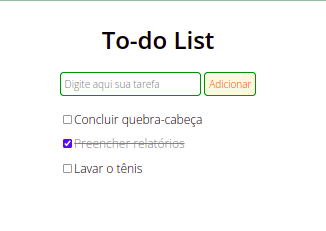

# To-do list

Este projeto é uma simples lista de tarefas.

## Requisitos propostos:

1. Criar um campo de `input` de texto e um botão para adicionar a tarefa à lista;
2. Quando o botão for pressionado, o texto deve aparecer na lista com um `checkbox` ao lado;
3. Quando o usuário selecionar o checkbox, o item correspondente deve ficar com o texto riscado.

## Ferramentas utilizadas:

- HTML5;
- CSS3;
- JavaScript;

### Resultado:

:smile:
